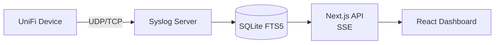

# syslog-unifi

Real-time UniFi firewall syslog viewer built with Next.js. Receives syslog messages over UDP/TCP, stores them in SQLite, and displays them in a live-updating web dashboard with advanced filtering and full-text search.


## Features

- **Live streaming** — real-time log display via Server-Sent Events
- **Syslog receiver** — built-in UDP + TCP server (RFC 3164, RFC 5424, UniFi CEF)
- **SQLite storage** — persistent storage with WAL mode and FTS5 full-text search
- **Advanced filtering** — filter by action (Allow/Drop/Reject), protocol, source/destination IP and port, firewall rule name
- **Full-text search** — search across all log messages
- **Virtual scrolling** — efficient rendering of large log volumes
- **Color-coded actions** — green (Allow), red (Drop), yellow (Reject)
- **Pagination** — browse historical logs with server-side pagination

## Prerequisites

- Node.js 20+
- A UniFi device configured to send syslog to this server (see [Configure UniFi](#configure-unifi))

## Getting Started

### Install

```bash
npm install
```

### Configure

Copy the example environment file and edit it:

```bash
cp .env.example .env.local
```

```env
# Port for the syslog receiver (UDP + TCP)
SYSLOG_PORT=5514
```

### Run

```bash
# Development
npm run dev

# Production
npm run build
npm start
```

Open [http://localhost:3000](http://localhost:3000) to view the dashboard.

## Configure UniFi

1. Open your UniFi Controller / UniFi OS console
2. Go to **Settings → System → Remote Logging** (or **SIEM** on newer firmware)
3. Set the syslog server to the IP address of the machine running this app
4. Set the port to match `SYSLOG_PORT` (default: `5514`)
5. Enable firewall logging on the desired rules

## Architecture



- **Syslog Server** (`src/lib/syslog-server.ts`) — listens on UDP + TCP, parses multiple syslog formats
- **Log Store** (`src/lib/log-store.ts`) — manages SQLite persistence, querying, real-time subscriptions
- **API Routes** (`src/app/api/`) — REST endpoints + SSE streaming
- **Dashboard** (`src/app/page.tsx`) — live and history modes with virtual scrolling

## Tech Stack

- [Next.js](https://nextjs.org) 16 with React Compiler
- [better-sqlite3](https://github.com/WiseLibs/better-sqlite3) with FTS5
- [shadcn/ui](https://ui.shadcn.com) + [Tailwind CSS](https://tailwindcss.com) v4
- [Lucide](https://lucide.dev) icons

## License

[MIT](LICENSE)
